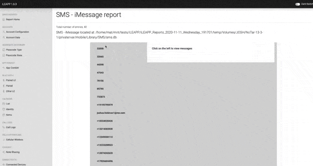

# 4n6notebooks
Sharing some notebooks I use for forensic research or examinations.
Use as you want, credit and thanks are is always welcome :)

## 1. SQLCipher decrypt
Notebook to decrypt database encrypted with SQLCipher.
Full python - 

### Dependencies :
- Python 3.7+
- PyCrypto

## 2. Chat rendering : 
Rendering extracted chats to dynamic HTML like an instant message app
 

Rely on a formatted Dataframe: 

input : df with following columns:
  * data-name str : contact name / number
  * data-time dt : time of message (needs to be datetime format)
  * message str : text message
  * content-type str : mime type of atachement or None (ex : 'image/jpeg')
  * file-path str : path of attachment to render
  * from_me bool : 0 if received, 1 if sent
output :
  * str including script and data to include in report html

Example can be found in the Signal parsing notebook

### Dependencies:
- Pandas

## 3. iOS Signal
Notebook to decrypt and parse Signal database 
Renders chat as HTML using Chat rendering #2

## 4. iOS Media Extraction
This notebook extracts media from an iOS filesystem dump (tar or zip)
and generates a gallery to browse images and videos.

### Dependencies:
- ffmpeg
- Pandas
- Pillow

## 5. iOS ProtonMail
Notebook to decrypt, parse and render ProtonMail messages in iOS. Valid for last version of ProtonMail (> 1.12)

### Dependencies
- ccl_bplist
- pycrypto
- plistlib
- pandas
- pgpy
